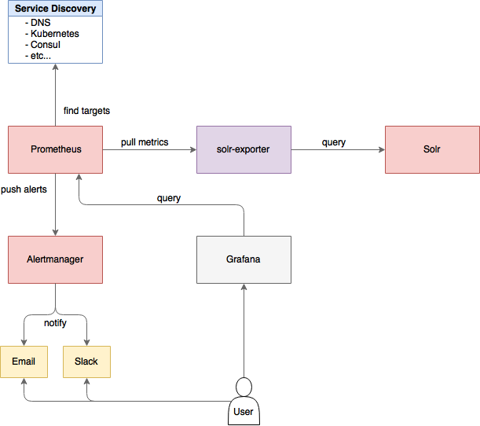

# solr-exporter

[Prometheus](https://prometheus.io) exporter for [Apache Solr](http://lucene.apache.org/solr/), written in Java.



## Installing solr-exporter

solr-exporter is available from the release page at [https://github.com/mosuka/solr-exporter/releases](https://github.com/mosuka/solr-exporter/releases).  
For all platform, download the `solr-exporter-<VERSION>-bin.zip` file.  
When getting started, all you need to do is extract the solr-exporter distribution archive to a directory of your choosing.  
To keep things simple for now, extract the solr-exporter distribution archive to your local home directory, for instance on Linux, do:

```text
$ cd ~/
$ unzip solr-exporter-0.3.2-bin.zip
$ cd solr-exporter-0.3.2
```

Once extracted, you are now ready to run solr-exporter using the instructions provided in the Running solr-exporter section.

## Running solr-exporter

You can start solr-exporter by running `./bin/solr-exporter` from the solr-exporter directory.

```text
$ ./bin/solr-exporter -p 9983 -b http://localhost:8983/solr -f ./conf/config.yml
```

If you are on Windows platform, you can start solr-exporter by running `.\bin\solr-exporter.bat` instead.

```text
> .\bin\solr-exporter.bat -p 9983 -b http://localhost:8983/solr -f .\conf\config.yml
```

You can also connect to Solr in SolrCloud mode like this.

```text
$ ./bin/solr-exporter -p 9983 -z localhost:2181/solr -f ./conf/config.yml
```

See command help:

```text
$ ./bin/solr-exporter -h
usage: SolrCollector [-h] [-v] [-p PORT] [-b BASE_URL] [-z ZK_HOST] [-f CONFIG] [-n NUM_THREADS]

Prometheus exporter for Apache Solr.

optional arguments:
  -h, --help             show this help message and exit
  -v, --version          Show version.
  -p PORT, --port PORT   solr-exporter listen port.
  -b BASE_URL, --baseurl BASE_URL
                         Specify Solr base URL when connecting to Solr in standalone mode (for example 'http://localhost:8983/solr').
  -z ZK_HOST, --zkhost ZK_HOST
                         Specify ZooKeeper connection string when connecting to Solr in SolrCloud mode (for example 'localhost:2181/solr').
  -f CONFIG, --config-file CONFIG
                         Configuration file.
  -n NUM_THREADS, --num-thread NUM_THREADS
                         Number of threads.
```

## Building from source

If you want to build solr-exporter from source, check-out the source using `git`.
Binaries are created in the `target` directory.

```text
$ cd ~/
$ git clone git@github.com:mosuka/solr-exporter.git
$ cd solr-exporter
$ mvn package
```


## Testing

If you modify the source code, make sure to run the test and succeed.

```text
$ mvn test
```


## Configuration

The configuration is in YAML. An example with all possible options:

```yaml
metrics:
  query:
    path: /admin/metrics
    params:
      - group: 'all'
      - type: 'all'
      - prefix: ''
      - property: ''
  jsonQueries:
    # solr_metrics_jetty_response_count
    - |-
      .metrics["solr.jetty"] | to_entries | .[] | select(.key | startswith("org.eclipse.jetty.server.handler.DefaultHandler")) | select(.key | endswith("xx-responses")) as $object |
      $object.key | split(".") | last | split("-") | first as $status |
      $object.value.count as $value |
      {
        name         : "solr_metrics_jetty_response_count",
        type         : "gauge",
        help         : "See following URL: https://lucene.apache.org/solr/guide/7_1/metrics-reporting.html",
        label_names  : ["status"],
        label_values : [$status],
        value        : $value
      }

...

collections:
  query:
    path: /admin/collections
    params:
      - action: 'CLUSTERSTATUS'
  jsonQueries:
    # solr_collections_cluster_status_live_nodes
    - |-
      .cluster.live_nodes | length as $value|
      {
        name         : "solr_collections_cluster_status_live_nodes",
        type         : "gauge",
        help         : "See following URL: https://lucene.apache.org/solr/guide/7_1/collections-api.html#clusterstatus",
        label_names  : [],
        label_values : [],
        value        : $value
      }

...

queries:
  - query:
      collection: collection1
      path: /select
      params:
        - q: "*:*"
        - start: 0
        - rows: 0
        - json.facet: |-
            {
              category: {
                type: terms,
                field: cat
              }
            }
    jsonQueries:
      # solr_facets_category
      - |-
        .facets.category.buckets[] as $object |
        $object.val as $term |
        $object.count as $value |
        {
          name         : "solr_facets_category",
          type         : "gauge",
          help         : "Category facets",
          label_names  : ["collection", "term"],
          label_values : ["collection1", $term],
          value        : $value
        }
```


Name        | Description
----------- | ---
metrics     | Scrape Metrics Reporting response. See following URL: [https://lucene.apache.org/solr/guide/7_0/metrics-reporting.html](https://lucene.apache.org/solr/guide/7_0/metrics-reporting.html).
collections | Scrape Collections API response. See following URL: [https://lucene.apache.org/solr/guide/7_0/collections-api.html](https://lucene.apache.org/solr/guide/7_0/collections-api.html)/
queries     | Scrape Search response. See following URL: [https://lucene.apache.org/solr/guide/7_0/searching.html](https://lucene.apache.org/solr/guide/7_0/searching.html).
query       | Specify the Solr query parameter. It should contains collection or core (optional), path, params.
jsonQueries | Specify the Json queries to parse json response. For more details, see [https://stedolan.github.io/jq/manual/](https://stedolan.github.io/jq/manual/).

Json query has to output JSON in the following format.

```json
{
  "name": "some_metric_name",
  "type": "gauge", 
  "help": "describe metric.",
  "label_names": ["label_name1", "label_name2"],
  "label_values": ["label_value1", "label_value2"],
  "value": 1.0
}
```

Name         | Description
------------ | ---
name         | Metric name. For more details, see [https://prometheus.io/docs/practices/naming/](https://prometheus.io/docs/practices/naming/).
type         | Metric type. For more detauils, see [https://prometheus.io/docs/concepts/metric_types/](https://prometheus.io/docs/concepts/metric_types/).
help         | Metric help. It must be metric description.
label_names  | Metric label names. For more details, see [https://prometheus.io/docs/practices/naming/](https://prometheus.io/docs/practices/naming/).
label_values | Metric label values. For more details, see [https://prometheus.io/docs/practices/naming/](https://prometheus.io/docs/practices/naming/).
value        | Metric value. It must be Double type.


## Grafana Dashboard

A Grafana dashboard is provided at the following URL.

https://grafana.com/dashboards/3888